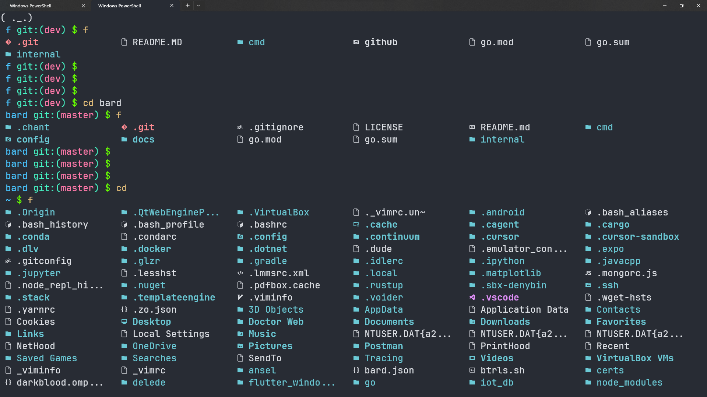

# **f** - simple `ls` alternative

**f** - is a little cli tool for listting files in current directory.
It's small, simple and easy to use (just run `f`), and written without any 3rd party dependencies

## Usage

Run `f` to list files, you can use flags to change the behavior:
1. `-a` - show hidden files ('dot' files)
2. `-p` - show path to the current directory



## Installation

[Nerd Font](https://www.nerdfonts.com) is required

```bash
git clone https://github.com/EnotInc/f.git
cd f/cmd/f
go install
```
